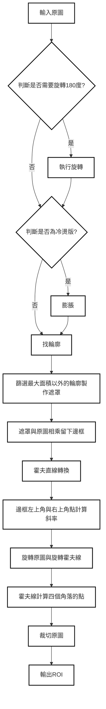
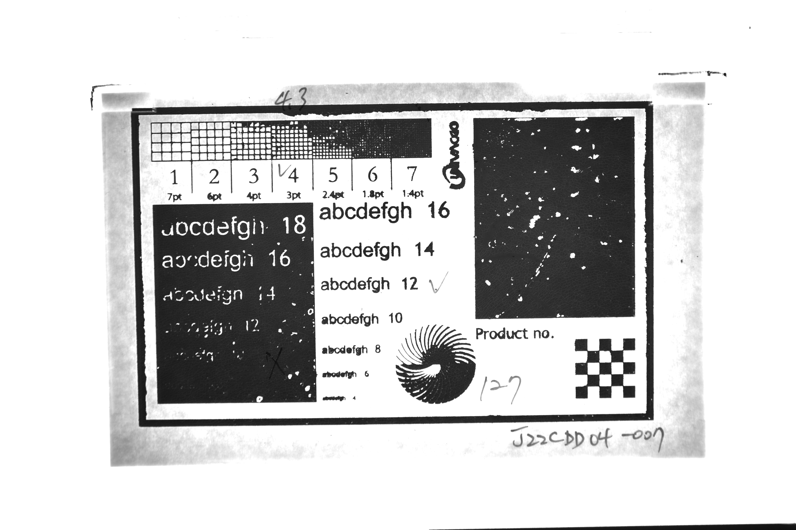
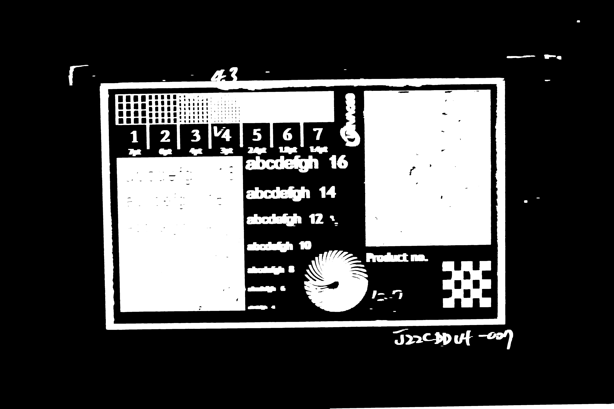
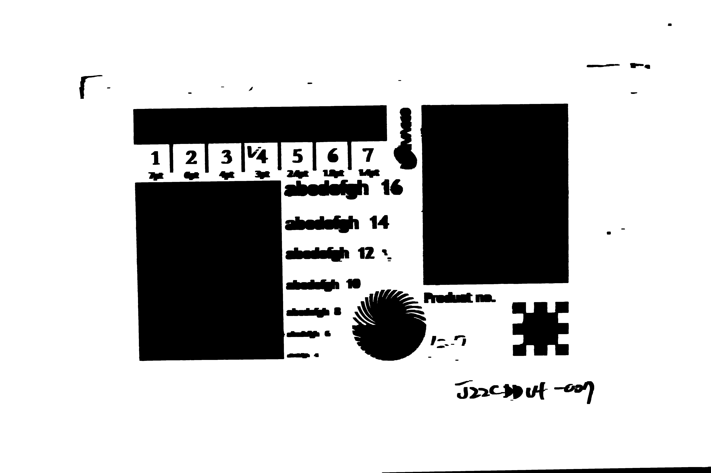
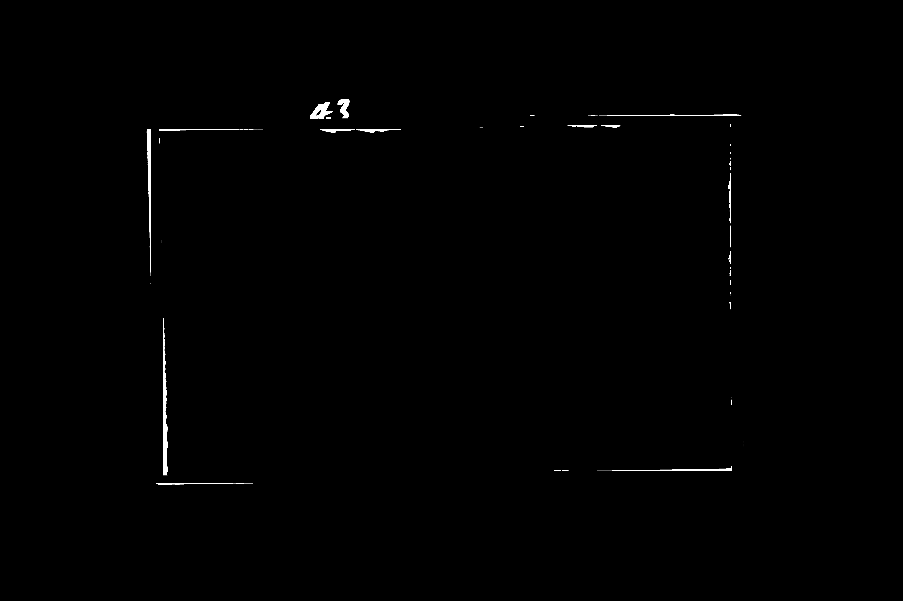
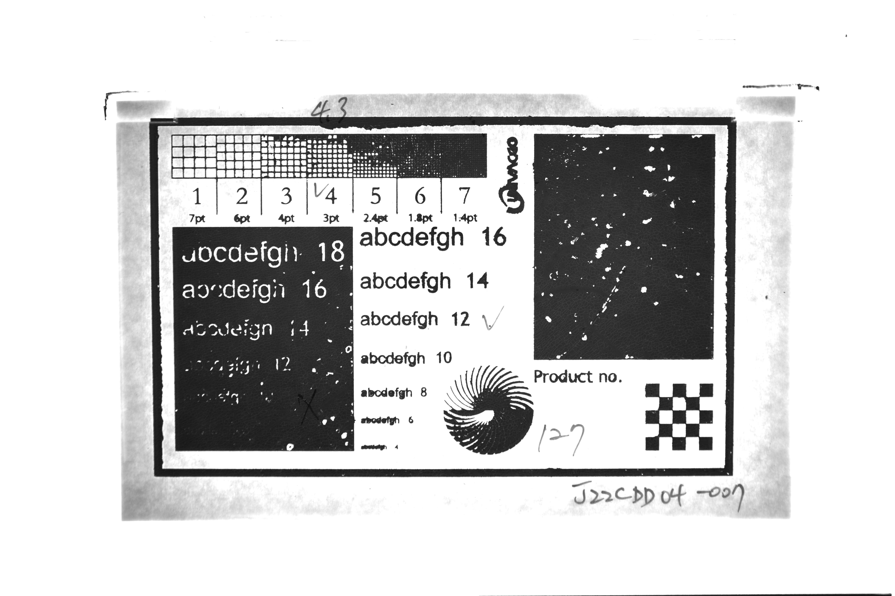
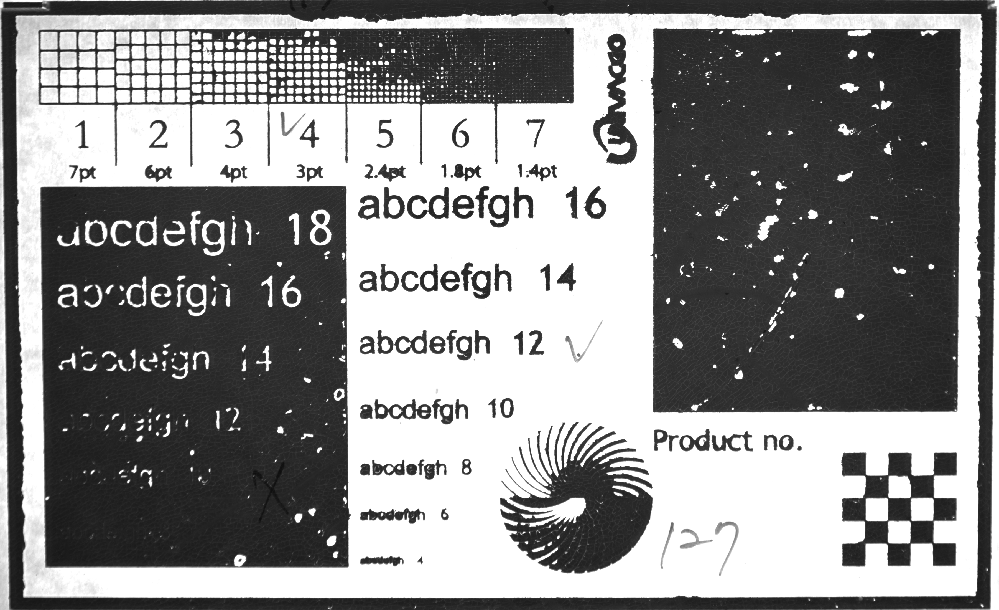
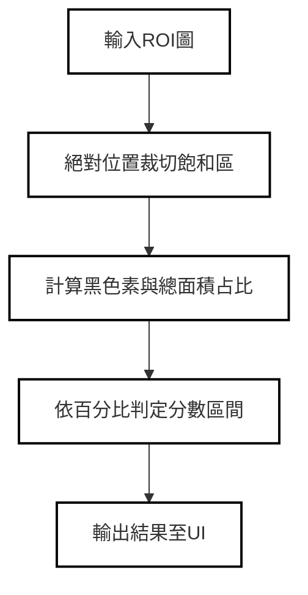
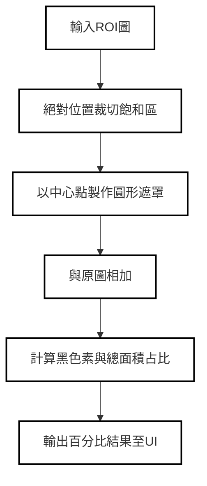
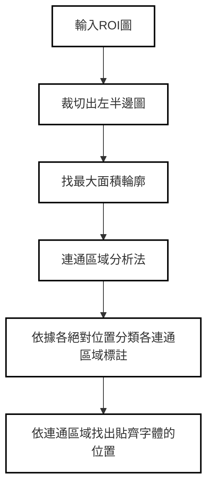

# 目錄
[主流程](#主流程)

[ROI](#ROI)

[切面分析](#切面分析)

[飽滿度](#飽滿度)

[螺旋區](#螺旋區)

[陰陽版](#陰陽版)

## 主流程

[回到目錄](#目錄)

## ROI

| 流程圖                     | 圖片                      |
|----------------------------|---------------------------|
|輸入原圖| |
|執行旋轉||
|膨脹| |
|找輪廓並製作遮罩| |
|遮罩與原圖相乘留下邊框| |
|霍夫直線轉換| |
|旋轉原圖| |
|輸出ROI| |

[回到目錄](#目錄)

## 切面分析
這是切面分析的內容

[回到目錄](#目錄)

## 飽滿度
這是飽滿度的內容。

[回到目錄](#目錄)

## 螺旋區
這是螺旋區的內容。

[回到目錄](#目錄)

## 陰陽版
這是陰陽版的內容。

[回到目錄](#目錄)
